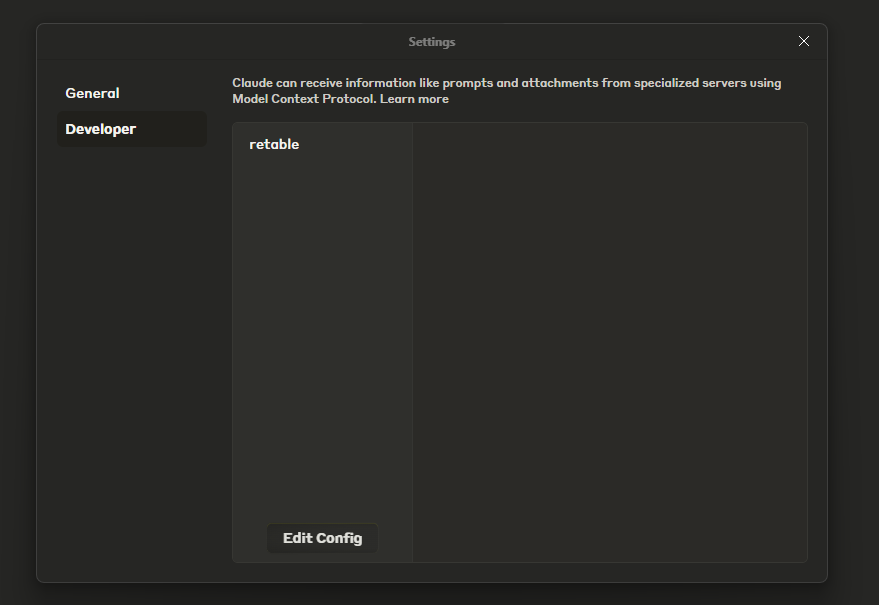
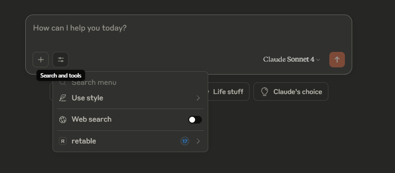
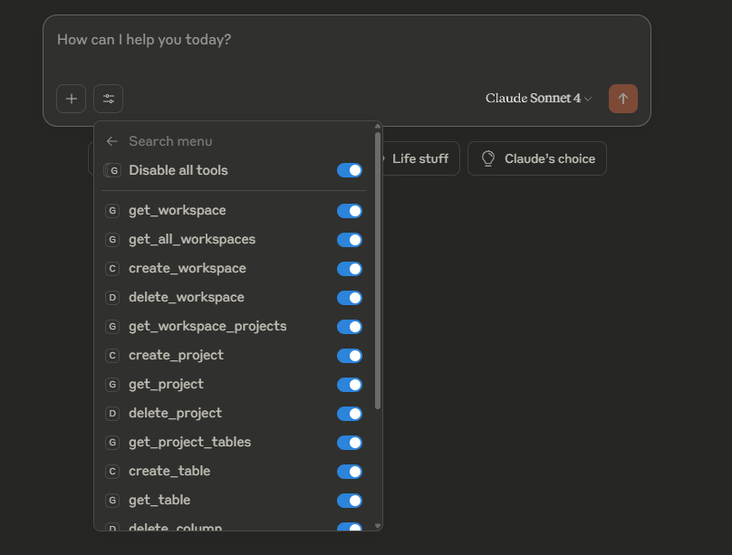

# Retable MCP Server: AI-Assisted Data Management

Connect AI agents like **Claude Desktop** to **Retable**. With this MCP server, AI agents can help manage your Retable data seamlessly.

## Table of Contents

- [Prerequisites](#prerequisites)
- [Installation](#installation)
  - [Local Installation](#local-installation-for-claude-desktop)
  - [Configuration for Claude Desktop](#configuration)
- [Development](#development)

## Prerequisites

Before getting started, make sure you have the following:

- [Node.js](https://nodejs.org/) (version **20.0.0 or later** required)
- A [Retable](https://retable.io) account
- A **Retable API Key**
  > You can generate your API key from the **API** tab.

## Installation

### Local Installation

```bash
npm install
npm run build
```

### Configuration for Claude Desktop

To use the MCP server, you must first configure your client (e.g., Claude Desktop). Most clients provide an option to add a new MCP server.

You’ll need to edit the **claude_desktop_config.json** file, which can be found in Claude Desktop via:

```bash
Settings → Developer → Edit Config
```



Below is a sample configuration for Claude Desktop to run the Retable MCP server.

⚠️ Make sure to set your **RETABLE_API_KEY** as an environment variable in your system.

⚠️ Replace **"path\\to\\dist\\index.js"** with the correct path format for your operating system.

> - On Windows, use double backslashes (\\) as shown.
> - On macOS/Linux, use forward slashes (/) instead
> - Make sure the dist/index.js file exists after running npm run build.

```jsonc
{
  "mcpServers": {
    "retable": {
      "command": "node",
      "args": ["path\\to\\mcp-server\\dist\\index.js"],
      "env": {
        "RETABLE_API_KEY": "$RETABLE_API_KEY"
      }
    }
  }
}
```

After the configuration, restart Claude Desktop and you will see the active Retable tools

|  |  |
| -------------------------- | ------------------------------------------ |

## Development

The project includes several npm scripts to help with development:

```bash
# Run TypeScript compiler in watch mode for development
npm run dev

# Build the project for production
npm run build

# Run ESLint on source files
npm run lint

# Automatically fix ESLint issues where possible
npm run lint:fix

# Test the MCP server locally with the inspector tool
npm run inspect
```

⚠️ To run `npm run inspect`, replace RETABLE_API_KEY to the inspect script:
